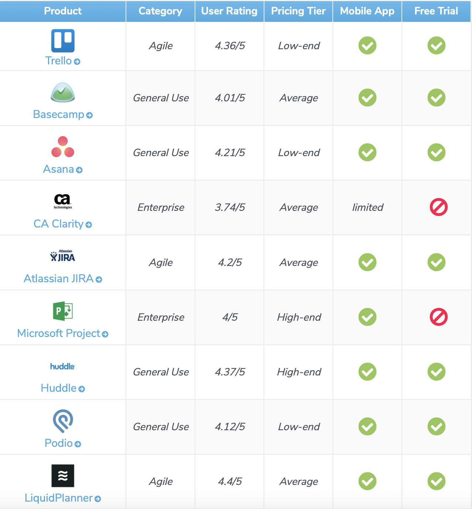
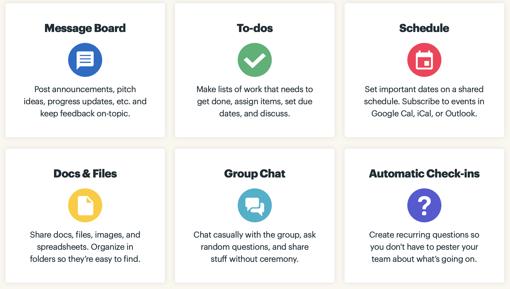
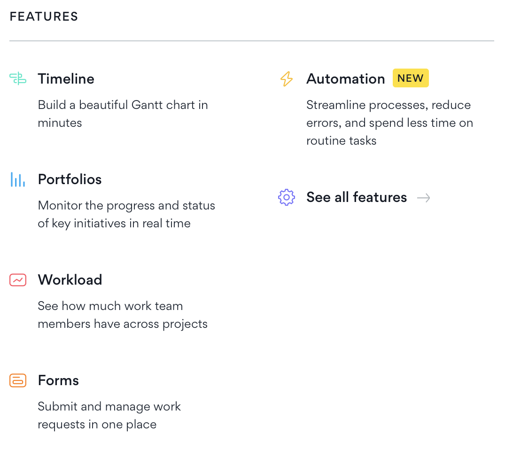

# Огляд існуючих програм

    

## [Trello](https://trello.com)
Trello — безкоштовна багатоплатформна система управління проектами, розроблена Fog Creek Software[en].

Вона використовує парадигму керування проектами, відому як канбан. Проекти зображуються дошками, що містять списки. Списки містять картки, якими зображуються задачі. Картки повинні переходити з попереднього списку до наступного (за допомогою перетягування), таким чином зображаючи рух якоїсь функції від ідеї, аж до тестування. Картці може бути присвоєно відповідальних за неї користувачів. Користувачі та дошки можуть об'єднуватись в команди.

### Особливості
Trello має обмежену підтримку тегів у вигляді шести кольорових міток. Картки можуть містити коментарі, вкладення, дату завершення та переліки (списки підзадач). Форматуються картки розміткою Markdown.

### Архітектура
Сайт побудовано на основі MongoDB, Node.js та Backbone.js

## [Basecamp](https://basecamp.com)
Basecamp — це платна клієнт-серверна система управління проектами. Розробляється однойменною компанією.

Дана система дуже проста у використанні, але разом з простотою їй гостро бракує життєво важливого функціонала для того, щоб її можна було використовувати в серйозних, більш-менш великих проектах. Розробники з 37signals спростили все, що тільки можна було спростити: немає системи баг-трекінга — немає взагалі такого поняття як баг, неможливо простежити за станом проекту, тільки за загальним прогресом і так далі.

Все спілкування відбувається у вигляді блогу, завдання ставляться як to-do списки, що зручно тільки в разі якихось загальних описів для розвитку проекту. Також немає можливості складати звіти.

Проте, у неї достатньо плюсів. Система легка в освоєнні, що дозволяє швидко почати роботу з нею, має гарний і швидкий веб-інтерфейс, wiki-проекти, блог тощо.

Систему можна рекомендувати невеликим командам і вільним розробникам.

### Особливості

    

## [ASANA](https://asana.com) 
Asana — програмне забезпечення для веб і мобільних пристроїв, призначене для спільної роботи над проектами без електронної пошти. Було створене співзасновником Facebook Дастіном Московіцем і колишнім інженером Джастіном Розенштейном, які працювали над підвищенням продуктивності співробітників на Facebook.

### Особливості

    

## [Microsoft Project](https://products.office.com/uk-ua/project/project-management-software)
Microsoft Project — система управління проектами, розроблена корпорацією Microsoft. Microsoft Project створений, щоб допомогти менеджерові проекту в розробці планів, розподілі ресурсів за завданнями, відстежуванні прогресу і аналізі обсягів робіт.

Microsoft Project створює розклади критичного шляху. Розклади можуть бути складені з урахуванням використовуваних ресурсів. Ланцюжок візуалізується в діаграмі Ганта.

Для користувачів Microsoft Project в СНД компанія Microsoft за підтримки своїх партнерів створила портал MicrosoftProject.ru на якому публікуються останні матеріали щодо продукту і рейтинг розробників.

В листопаді 2012 року на ринок вийшли нові версії Microsoft Project 2013 та Microsoft Project Server 2013. Також на ринок у першому кварталі 2013 року вийде новий продукт Microsoft Project Online, який буде представлено у пакеті Office 365.

## [Atlassian JIRA](https://www.atlassian.com/ru/software/jira)
Atlassian JIRA — система відстеження помилок, призначена для організації спілкування з користувачами, і для управління проектами. Розроблена компанією Atlassian в 2002 році. Доступна в двох версіях: «хмарній» і серверній. Зараз JIRA включає в себе три проекти: JIRA Software (для розробників), JIRA Service Desk (підтримка проекту), JIRA Core (управління проектами), кожен з яких можна купити окремо. Назва системи (JIRA) отримано шляхом модифікації японської назви Годзіла («Gojira»), що в свою чергу є алюзією на назву конкуруючого продукту — Bugzilla. JIRA створювалася як заміна Bugzilla й багато в чому повторює архітектуру останньої. На даний момент (2018 рік) JIRA є однією з найпопулярніших систем управління проблемами.
